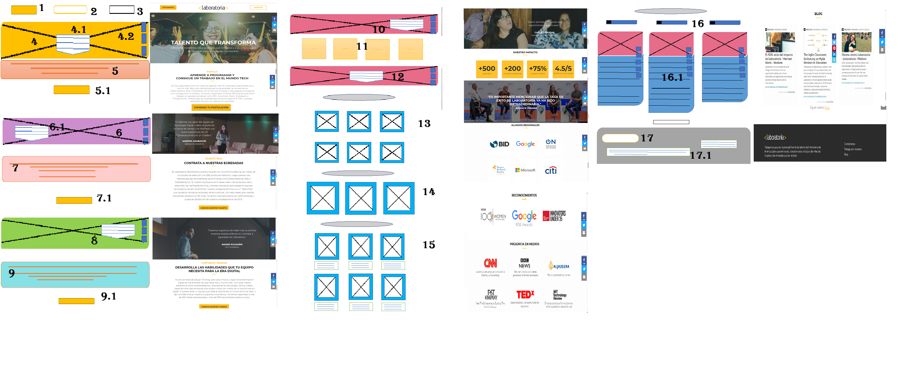
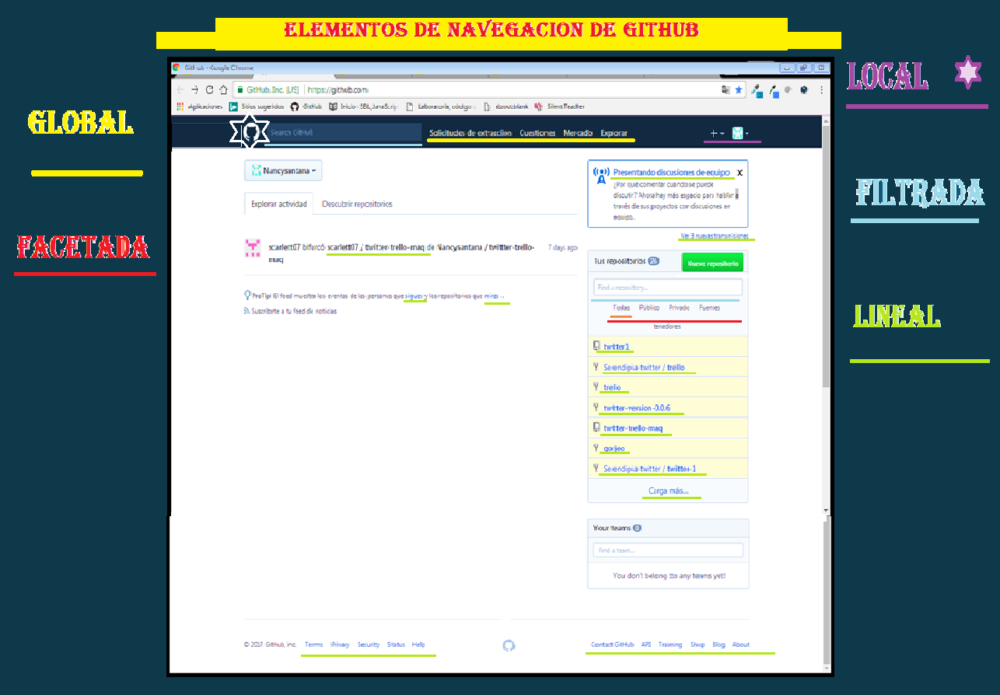
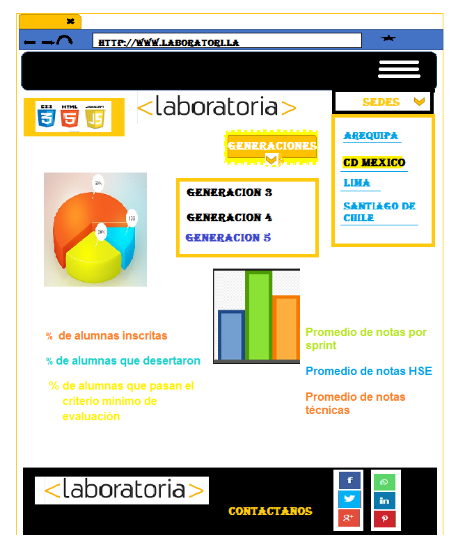

# UX - IU

Crear una buena interacción en la página que nos permita entender el objetivo principal (captar la atención de mujeres a postular y formar parte del Mundo tech y sobre todo de Laboratoria), dando más información desarrollo web, para mujeres y programa educativo que permita darles seguridad que es un muy buen lugar para estudiar y aprender programación y muchas cosas más. Hacerles saber que es un desarrollo y todo un mundo de posibilidades por descubrir y no solo en aprendes código también vas formando una familia que siempre está ahí para ti.
También es importante captar la atención de empresas para que conozcan y tomen los cursos que ofrece Laboratoria y capacitar a su equipo de trabajo de esta manera permitan evolucionar al negocio con un alto rendimiento. Aparte de capacitar pueden dar empleo a egresadas de Laboratoria que usan metodologías que las ayudan a generar nuevos conocimientos y desarrollar productos/servicios.
Debe estar enfocado principalmente a mujeres interesadas en aprender más sobre el mundo TECH.
También que Permite a las empresas acceder al talento que ofrece Laboratoria y postear una oferta en la misma.
1. El botón será sombreado de color amarillo para resaltar el objetivo principal (muchas mujeres sean estudiantes de Laboratoria y postulen) ser parte de Laboratoria y del mundo tech.
2. El logo estará en el encabezado y centrado con el Objetivo visual de ser reconocido y se identifique con Laboratoria.
3. El tercer botón delimitara a las empresas con objetivo de capacitarlas dando cursos a su equipo y/o contratar Egresadas. Tendrá un enlace a más información y referencia de empresas.
4. La imagen elegida será de Estudiantes Egresadas ya que muestra visualmente el logro de las chicas una vez concluido su estudio y de esta manera las postulantes se sentirán confiadas de registrarse y ser parte de Laboratoria.
Para dar más énfasis al objetivo principal se agregará un eslogan con letras grandes y negritas para resaltar.
5. El titulo será de letras grandes negritas y centradas de esta manera resaltaremos que lo que pueden aprender y lograr, posteriormente Un breve resumen sobre lo que es Laboratoria, sus logros y facilidades para ser parte. Todo esto con un fondo blanco ya que es la tendencia visual en muchas páginas.
5.1 Tendrá un botón de sombreado amarillo que permitirá un enlace con más información.
6. Colocaremos una imagen de Egresada de Laboratoria para que nos de su testimonio, de esta forma haremos saber que muchas mujeres pueden lograr ser parte del mundo TECH.
7. Una breve información sobre lo que Laboratoria hace para que las chicas aprendan y sean capaces de trabajar en sus empresas con un enlace para más información sobre los talentos que se logran.  
7.1 Este botón será de color naranja y sombreado centrado con letras color negro para que el visitante de esta manera dar click lo que le permitirá saber más sobre egresadas y sus talentos de esta manera las empresas puedan contratar estos talentos y así mejor sus empresas y/o equipos. El objetivo es dar seguridad de que contratar a personal capacitado.
8. Se elige una foto de un testimonio empresarial con una breve información sobre su experiencia. con un texto de color blanco para logra un contraste con la imagen y resaltar su testimonio.
9. Síntesis de cursos que ofrece Laboratoria a las empresas.
9.1 Este botón será de color naranja y sombreado centrado con letras color negro con más información para conocer los cursos que Laboratoria ofrece para capacitar al personal de las empresas y de esta manera tener mejor capacitados a sus equipos laborales.
10. Escogeremos colocar una imagen de un testimonio que ya conoce el curso y su experiencia para que más empresas se identifiquen y se convenzan de ser parte del curso para mejorar y ser capases de mejorar sus logros. continuamos con un texto breve centrado y de fondo blanco para una mejor experiencia.
11. Cuadros de color naranja y sombreados para enfatizar la información con Cifras que muestren el gran impacto sobre egresadas y empresas con objetivo de informar y motivar a ser parte de Laboratoria.
12. Imagen grande con gran impacto para dar a conocer que es un lugar conocido y de esta manera las personas visitantes a la página se sientan seguras, La imagen elegida muestra una entrevista con personajes importantes.
13. Se colocará la imagen de Empresas aliadas a Laboratoria a nivel Regional en un tamaño mediano con un título centrado.
14. Imágenes de Empresas que han otorgado un reconocimiento.
15. Imágenes de los medios que han dado a conocer Laboratoria con una breve información.
16. Imágenes con información de BLOG y su título.
16.1 Cada BLOG con su icono de contacto e información.
17. Logotipo de Laboratoria.
17.1 síntesis de información haciendo énfasis del objetivo y medios de contacto.

# Navegacion

# sketch para la herramienta del dashboard de Laboratoria

